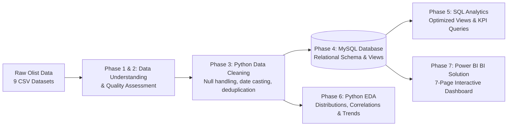

# 📊 Brazilian E-Commerce Analytics & Business Intelligence

An end-to-end data analytics and business intelligence project analyzing **~100,000 orders** across Brazilian marketplaces (2016–2018) from the Olist dataset. This project covers data cleaning, relational data modeling in MySQL, exploratory data analysis (EDA) in Python, and multi-page interactive reporting in Power BI.

---

<p align="center">
  
  
  
  
  
</p>

---

## 📌 Executive Summary & Key Metrics

Between **2016 and 2018**, Olist processed commercial transactions connecting thousands of sellers to consumers across all 27 Brazilian states.

| Metric | Value | Description |
| :--- | :--- | :--- |
| **Total Revenue** | **R$ 16,008,872.12** | Total gross payment volume generated across all orders |
| **Total Orders** | **99,441** | Total transactions processed (96,478 delivered, ~97% fulfillment rate) |
| **Unique Customers** | **96,096** | Distinct consumers distributed across 4,119 Brazilian cities |
| **Average Order Value (AOV)** | **R$ 160.99** | Mean spend per distinct transaction |
| **Average Delivery Time** | **12.09 Days** | Mean delivery cycle from purchase to customer doorstep (median: 10 days) |
| **Average Review Score** | **4.09 / 5.00** | Overall marketplace customer satisfaction index |
| **Active Sellers** | **3,095** | Marketplace merchants across 71 product categories |

---

## 📑 Table of Contents

- [Project Architecture & Pipeline](#-project-architecture--pipeline)
- [Database Schema & Data Model](#-database-schema--data-model)
- [Power BI Dashboard Showcase](#-power-bi-dashboard-showcase)
- [Key Business Insights](#-key-business-insights)
- [Actionable Recommendations](#-actionable-recommendations)
- [Repository Structure](#-repository-structure)
- [Installation & Quickstart](#-installation--quickstart)
- [Dataset & References](#-dataset--references)

---

## 🏗️ Project Architecture & Pipeline



1. **Data Understanding & Ingestion**: Evaluated 9 raw CSV files representing ~100k orders, geolocation records, line items, customer demographics, seller profiles, payment installments, and reviews.
2. **Data Cleaning & Preprocessing (Python / Pandas)**: Handled missing values in order timestamps, standardized Portuguese-to-English product translations, normalized geographic coordinates, and exported cleaned CSVs.
3. **Relational Database Design (MySQL)**: Structured tables with primary and foreign keys, enforced integrity constraints, and created modular analytical views.
4. **Exploratory Data Analysis (EDA)**: Analyzed sales trends, delivery latency distributions, payment installments, and category revenue drivers.
5. **Business Intelligence (Power BI)**: Built an interactive, 7-page executive BI dashboard suite with dynamic filtering, DAX measures, and geo-spatial mapping.

---

## 🗄️ Database Schema & Data Model

The relational schema standardizes the e-commerce data into 8 interconnected tables within MySQL:

<p align="center">
  
</p>

### Core Tables & Descriptions

- **`customers`**: `customer_id` (order-level token), `customer_unique_id` (individual customer key), city, state, zip prefix.
- **`orders`**: Order lifecycle tracking with purchase, payment approval, carrier handoff, customer delivery, and estimated delivery timestamps.
- **`order_items`**: Individual items per order including `product_id`, `seller_id`, price, and shipping freight value.
- **`products`**: Product specifications, physical dimensions, weight, and category naming.
- **`product_category_translation`**: English translation dictionary for 71 Portuguese product categories.
- **`sellers`**: Seller identification and geographic origin.
- **`order_payments`**: Split payment transactions, installment plans, payment methods (Credit Card, Boleto, Voucher, Debit).
- **`order_reviews`**: Customer review score (1–5) and feedback timestamp details.
- **`geolocation`**: Latitude/longitude mappings across Brazilian postal zip prefixes.

### Reusable SQL Views (`SQL/Views.sql`)

- `vw_executive_dashboard`: Consolidated denormalized view powering high-level BI reporting.
- `vw_sales_summary`: Order-level summary with line item counts and total order value.
- `vw_customer_summary`: Lifetime customer spend, order frequency, and geographic location.
- `vw_seller_performance`: Revenue, units sold, and average order value per seller.
- `vw_delivery_performance`: Actual delivery duration versus estimated delivery dates with on-time flags.
- `vw_monthly_sales`: Monthly revenue, transaction volume, and AOV trajectory.
- `vw_state_performance`: State-level revenue, order volume, review score, and average delivery latency.

---

## 📈 Power BI Dashboard Showcase

The Power BI report (`PowerBI/Project 2.pbix`) provides interactive decision-support across 7 analytical dimensions:

### 1. Executive Dashboard
> High-level executive overview of total revenue, order volumes, customer distribution, and top performing categories.

<p align="center">
  
</p>

---

### 2. Sales Performance Analysis
> Monthly sales volume, historical revenue growth trends, and transaction velocity across time.

<p align="center">
  
</p>

---

### 3. Customer Demographics & Behavior
> Regional customer distribution, state-level purchasing patterns, and order frequency.

<p align="center">
  
</p>

---

### 4. Seller & Delivery Operations
> Delivery timeframe analysis, carrier fulfillment speed, late shipment rates, and seller revenue distribution.

<p align="center">
  
</p>

---

### 5. Payment & Installment Analytics
> Revenue breakdown by payment method (Credit Card, Boleto, Voucher, Debit Card) and installment behavior.

<p align="center">
  
</p>

---

### 6. Product Category Analytics
> Category sales volume, revenue contribution, and average selling price across 71 categories.

<p align="center">
  
</p>

---

### 7. Geographical Market Analysis
> Geo-spatial mapping of revenue, customer density, and freight economics across Brazilian states.

<p align="center">
  
</p>

---

## 💡 Key Business Insights

### 💰 Revenue & Sales Dynamics
- **Peak Growth in 2017–2018**: Order volume and revenue grew steadily, peaking during Q4 promotional events (Black Friday in November).
- **Category Concentration**: The top categories (`health_beauty`, `watches_gifts`, `bed_bath_table`, `sports_leisure`, `computers_accessories`) account for a significant share of total marketplace revenue.

### 💳 Payment Preferences
- **Credit Card Dominance**: **73.9%** of total payment volume is completed via Credit Card, followed by **Boleto Bancário (~19.0%)**.
- **Installment Financing**: Customers frequently utilize 1 to 4 installments for everyday purchases, while higher ticket items extend up to 10+ installments.

### 🚚 Logistics & Delivery Efficiency
- **Fulfillment Timelines**: Average delivery takes **12.09 days**, with the majority delivered well ahead of the estimated delivery date (~92% on-time delivery rate).
- **Geographical Disparity**: Southeast states (SP, RJ, MG) experience rapid deliveries (average 7–10 days), whereas North and Northeast regions (RR, AP, AM) face longer transit times (20–25+ days) and higher freight costs.

### ⭐ Customer Satisfaction
- **Delivery Time Directly Impacts Ratings**: Orders delivered on or before the estimated delivery date average **4.2+ stars**, whereas delayed shipments drop satisfaction below **2.5 stars**.
- High-satisfaction categories maintain consistent review scores above 4.1.

---

## 🎯 Actionable Recommendations

1. **Regional Logistics Optimization**: Establish localized fulfillment centers or partner with regional carrier hubs in Northern and Northeastern states to lower delivery latency and reduce freight costs.
2. **Targeted Seller Quality Programs**: Implement seller SLA benchmarks for packaging and carrier handoff times to prevent fulfillment delays.
3. **Credit & Payment Incentives**: Offer instant payment discounts (e.g., PIX or Boleto discounts) to reduce credit card transaction fees while promoting flexible installment plans on premium product tiers.
4. **Category Marketing Focus**: Reallocate ad spend toward top-margin, high-satisfaction categories (`health_beauty`, `watches_gifts`, `computers_accessories`) and bundle complementary items.

---

## 📂 Repository Structure

```text
Brazilian-Ecommerce-Analytics/
│
├── Dash Board Images/                  # Exported Power BI dashboard screenshots
│   ├── 1.Executive Dashboard.png
│   ├── 2. Sales Analysis.png
│   ├── 3.Customer Analysis.png
│   ├── 4. Seller & Delivery Analysis.png
│   ├── 5.Payment Analysis.png
│   ├── 6.Product Analysis.png
│   └── 7. Geographical Analysis.png
│
├── Data/
│   ├── Raw/                            # Original 9 Olist CSV files
│   ├── Cleaned/                        # Intermediate staged data
│   └── Processed/                      # Cleaned CSVs formatted for MySQL database ingestion
│
├── NoteBooks/
│   ├── 01_data_understanding.ipynb     # Schema exploration, null inspection & summary statistics
│   ├── data_cleaning.ipynb             # Data type conversions, missing value imputation & ETL
│   └── exploratory_data_analysis.ipynb # Deep-dive statistical analysis & KPI visual exploration
│
├── PowerBI/
│   └── Project 2.pbix                  # Complete multi-page Power BI reporting file
│
├── SQL/
│   ├── Tables.sql                      # DDL schema creation & LOAD DATA INFILE scripts
│   ├── Views.sql                       # Reusable SQL analytical views
│   ├── Customer Analysis.sql           # Customer RFM and geographic SQL queries
│   ├── Delivery Analysis.sql           # Logistics and carrier delay queries
│   ├── Executive Business Insights.sql # High-level strategic business queries
│   ├── Payment Analysis.sql            # Payment method and installment metrics
│   ├── Product Analysis.sql            # Category revenue and pricing queries
│   ├── Review Analysis.sql             # Review score and satisfaction queries
│   ├── Sales Analysis.sql              # Monthly growth and revenue trajectory
│   └── Seller Analysis.sql             # Merchant throughput and revenue analysis
│
├── Schema.png                          # Relational database entity-relationship diagram
├── requirements.txt                    # Python library dependencies
└── README.md                           # Project documentation
```

---

## 🚀 Installation & Quickstart

### 1. Clone & Set Up Environment

```bash
# Clone the repository
git clone https://github.com/aravindreddym-034/Brazilian-Ecommerce-Analytics.git
cd Brazilian-Ecommerce-Analytics

# Create and activate virtual environment
python -m venv venv

# Windows (PowerShell)
.\venv\Scripts\Activate.ps1

# Linux / macOS
source venv/bin/activate

# Install required dependencies
pip install -r requirements.txt
```

### 2. Run Data Processing & Analytics Notebooks

Launch Jupyter Notebook or JupyterLab:

```bash
jupyter lab
```

Execute the notebooks in the following order:
1. `NoteBooks/01_data_understanding.ipynb`
2. `NoteBooks/data_cleaning.ipynb`
3. `NoteBooks/exploratory_data_analysis.ipynb`

### 3. Load & Query the MySQL Database

1. Open MySQL Workbench or your preferred SQL client.
2. Execute `SQL/Tables.sql` to create the schema and bulk-load data from `Data/Processed/`.
3. Execute `SQL/Views.sql` to generate standardized views.
4. Run individual analytical scripts in `SQL/` to extract business metrics.

### 5. Explore Power BI Reports

Open `PowerBI/Project 2.pbix` in **Power BI Desktop** to interact with the visualizations, apply slicers, and explore dynamic filters.

---

## 📚 Dataset & References

- **Dataset Source**: [Kaggle - Brazilian E-Commerce Public Dataset by Olist](https://www.kaggle.com/datasets/olistbr/brazilian-ecommerce)
- **Timeframe**: 2016 to 2018
- **Geography**: Brazil (All 27 States, 4,000+ Municipalities)

---

<p align="center">
  <sub>Developed by <b>Aravind Reddy</b> • Brazilian E-Commerce Analytics Project</sub>
</p>
