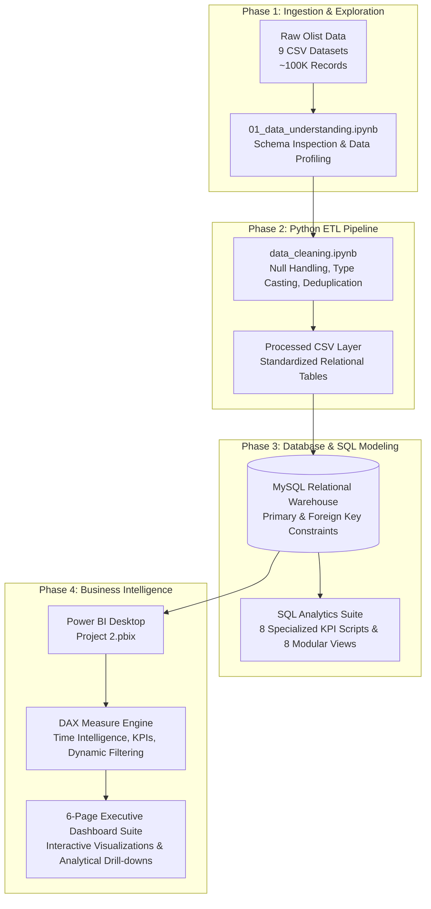

# 📊 Brazilian E-Commerce Analytics & Business Intelligence Suite

<p align="center">
  
  
  
  
  
  
  
</p>

<p align="center">
  <b>An enterprise-grade, end-to-end Data Analytics and Business Intelligence solution analyzing ~100,000 commercial transactions from the Olist Brazilian E-Commerce marketplace (2016–2018).</b><br>
  <i>Encompassing automated Python ETL pipelines, normalized MySQL data warehousing, advanced SQL analytical modeling, and an interactive 6-page Power BI executive dashboard suite.</i>
</p>

---

## 📌 Executive Summary & Marketplace KPIs

Between **2016 and 2018**, Olist connected thousands of independent merchants to consumers across all **27 Brazilian federative units**. This project uncovers macroeconomic growth drivers, regional logistics bottlenecks, customer purchasing habits, payment methods, and category margins to provide actionable strategic recommendations.

<div align="center">

| Metric | Benchmark Value | MoM / Period Trend | Strategic Significance |
| :--- | :---: | :---: | :--- |
| 💵 **Total Revenue** | **R$ 16,008,872.12** | <span style="color:#2ecc71">▲ **+28.6%**</span> | Gross payment volume across 99.4K marketplace transactions |
| 📦 **Total Orders** | **99,441** | <span style="color:#2ecc71">▲ **+25.4%**</span> | Processed orders (96,478 delivered, **97.02%** fulfillment rate) |
| 👥 **Unique Customers** | **96,096** | <span style="color:#2ecc71">▲ **+24.7%**</span> | Distinct consumers across 4,119 Brazilian cities |
| 🏷️ **Average Order Value (AOV)** | **R$ 160.99** | <span style="color:#2ecc71">▲ **+2.8%**</span> | Mean customer transaction spend |
| 🚚 **Average Delivery Time** | **12.09 Days** | <span style="color:#2ecc71">▲ **+3.2%** (Speed)</span> | Doorstep delivery cycle (Median: 10.0 days; On-Time: **92.0%**) |
| ⭐ **Average Review Score** | **4.09 / 5.00** | <span style="color:#2ecc71">▲ **+0.15**</span> | Overall customer satisfaction index across 71 categories |
| 🏪 **Active Sellers** | **3,095** | <span style="color:#3498db">● Active</span> | Marketplace merchants distributing across 71 product categories |

</div>

---

## 📑 Table of Contents

- [🏗️ Project Architecture & Pipeline](#️-project-architecture--pipeline)
- [📈 Power BI Interactive Dashboard Suite](#-power-bi-interactive-dashboard-suite)
  - [1. Executive Dashboard](#1-executive-dashboard)
  - [2. Sales Performance Analysis](#2-sales-performance-analysis)
  - [3. Customer Demographics & Behavior](#3-customer-demographics--behavior)
  - [4. Seller & Delivery Operations](#4-seller--delivery-operations)
  - [5. Payment & Installment Analytics](#5-payment--installment-analytics)
  - [6. Product Category Analytics](#6-product-category-analytics)
- [🗄️ Relational Database Schema & Data Model](#️-relational-database-schema--data-model)
- [📐 DAX Measures & Analytical Logic](#-dax-measures--analytical-logic)
- [💡 Key Business Insights](#-key-business-insights)
- [🎯 Strategic Recommendations](#-strategic-recommendations)
- [📂 Repository Structure](#-repository-structure)
- [🚀 Quickstart & Setup Guide](#-quickstart--setup-guide)
- [🛠️ Tech Stack & Technologies](#️-tech-stack--technologies)
- [📚 Dataset & References](#-dataset--references)

---

## 🏗️ Project Architecture & Pipeline



### End-to-End Workflow Breakdown

1. **Data Ingestion & Quality Assessment**: Profiling raw files covering orders, items, customers, sellers, payments, reviews, products, translations, and geolocations.
2. **Automated Python ETL Pipeline**: Imputation of missing timestamps, normalization of Portuguese-to-English product categories, coordinate clustering, and generation of clean datasets.
3. **Relational MySQL Data Warehousing**: Construction of structured schemas with enforced primary/foreign keys, indexed lookup tables, and modular analytical SQL views.
4. **Exploratory Data Analysis (EDA)**: Statistical hypothesis testing, correlation matrices, revenue concentration curves, and delivery latency regressions in Jupyter.
5. **Power BI Business Intelligence**: Data modeling using Star/Snowflake schemas, DAX measures (MoM growth, fulfillment rates, AOV, installment distribution), and interactive user interface design.

---

## 📈 Power BI Interactive Dashboard Suite

The Power BI Solution (`PowerBI/Project 2.pbix`) provides interactive decision-support across **6 dedicated analytical modules**:

```
PowerBI/Project 2.pbix
 ├── 1. Executive Dashboard          -> Macro KPIs, Revenue & Order Trends, Fulfillment Status Matrix
 ├── 2. Sales Performance Analysis  -> Cash Flow by Tender Type, Monthly Freight Economics, Installments
 ├── 3. Customer Demographics       -> State Distribution, Top 10 Metropolitan Cities, Review Scores
 ├── 4. Seller & Delivery Operations-> Merchant Concentration, Seller Geography, Delivery Timelines
 ├── 5. Payment & Installments      -> Transaction Bins, Multi-Sequence Split Tender, Installment Depth
 └── 6. Product Category Analytics  -> Category Contribution, Price Elasticity Treemaps, Sales Velocity
```

---

### 1. Executive Dashboard
> **Strategic Focus**: C-Suite operational pulse tracking macro-level marketplace health, financial performance, and fulfillment reliability.

<p align="center">
  
</p>

- **Key Performance Indicators (Scorecards)**:
  - 💵 **Total Revenue**: `R$ 16.01M` (Gross marketplace revenue volume across all completed transactions)
  - 📦 **Total Orders**: `99K` (Total commercial orders placed on the platform)
  - 👥 **Total Customers**: `96K` (Distinct consumer base across Brazilian municipalities)
  - ⭐ **Average Review Score**: `4.09 / 5.00` (Marketplace satisfaction rating)
  - 🚚 **On-Time Delivery %**: `92%` (Fulfillment reliability benchmark meeting estimated delivery dates)
  - 🏷️ **Average Order Value (AOV)**: `R$ 160.99` (Mean spend per transaction)
- **Visual Analytics**:
  - **Total Revenue by Month Year**: Area line chart tracking revenue growth trajectory from Sep 2016 through Sep 2018, capturing rapid expansion across 2017 to peak in **Nov 2017 (Black Friday, ~R$ 1.15M–1.2M)**, and sustained high performance throughout Jan–Jul 2018 (~R$ 1.0M–1.15M/month).
  - **Total Orders by Month Year**: Monthly order volume progression climbing from early volumes in 2016 to a high of **~7.3K orders in Nov 2017**, maintaining **~6.2K–7.1K orders per month** through mid-2018.
  - **Order By Status (Donut Chart & Detailed Breakdown Matrix)**:
    - 🔵 **delivered**: **96K (97.02%)** — dominant successful fulfillment
    - 🔷 **shipped**: **1K (1.11%)** — orders in transit
    - 🟠 **canceled**: **508 (0.51%)** — buyer/seller cancellations
    - 🟣 **unavailable**: **286 (0.29%)** — inventory stockout exceptions
    - 🟪 **invoiced**: **167 (0.17%)** — invoice generated awaiting carrier pickup
    - 🟣 **processing**: **81 (0.08%)** — payment approved, processing fulfillment
    - 🟡 **created**: **48 (0.05%)** — newly created orders
    - 🔴 **approved**: **22 (0.02%)** — approved payment orders
- **Footer**: `Source: Olist Brazilian E-Commerce Dataset`

---

### 2. Sales Performance Analysis
> **Strategic Focus**: Revenue engine diagnostics, payment tender cash-flow distribution, logistics freight overhead, and installment financing behavior.

<p align="center">
  
</p>

- **Interactive Controls**: Date Range Slicer (`Sep 2016 - Oct 2018`).
- **Visual Analytics**:
  - **Total Revenue by Payment Type (Donut Chart)**: Demonstrates **Credit Card dominance at 78.34% (R$ 12.54M)**, followed by **Boleto Bancário at 17.92% (R$ 2.87M)**, **Voucher at 2.37% (R$ 0.38M)**, and Debit Card / Undefined.
  - **Monthly Freight Cost (Line Chart)**: Tracks freight expenditure over time, rising from under R$ 10K in late 2016 to peak surges of **~R$ 175K in Nov 2017** and sustaining **~R$ 160K–R$ 185K/month** across 2018 alongside order volume growth.
  - **Total Products Sold by Month Year (Line Chart)**: Unit sales volume progression scaling from <1K items in late 2016 to a peak of **>9K units in Nov 2017**, and sustaining **7.5K–8.5K units monthly** throughout 2018.
  - **Orders by Payment Installments (Bar Chart)**: Distribution analysis showing single-installment transactions strongly dominate (**>53K orders**), followed by 2 installments (~12K), 3 installments (~10K), 4 installments (~7K), 5 installments (~5K), with a notable secondary surge at **10 installments (~5K orders)** for higher-ticket purchases, extending out to 24 installments.
- **Footer**: `Source: Olist Brazilian E-Commerce Dataset`

---

### 3. Customer Demographics & Behavior
> **Strategic Focus**: Regional customer concentration, high-density metropolitan markets, and satisfaction sentiment distribution.

<p align="center">
  
</p>

- **Interactive Controls**: Date Range Slicer (`Nov 2016 - May 2018`).
- **Visual Analytics**:
  - **Customers by State (Horizontal Bar Chart)**: Ranking displaying extreme geographic concentration in the Southeast and South regions: **São Paulo (`SP`) leading with ~41.7K customers**, followed by **Rio de Janeiro (`RJ`) with ~12.9K**, **Minas Gerais (`MG`) with ~11.6K**, **Rio Grande do Sul (`RS`) with ~5.5K**, **Paraná (`PR`) with ~5.0K**, **Santa Catarina (`SC`) with ~3.6K**, **Bahia (`BA`) with ~3.4K**, **Distrito Federal (`DF`) with ~2.1K**, **Espírito Santo (`ES`) with ~2.0K**, and **Goiás (`GO`) with ~2.0K**.
  - **Top 10 Customer Cities (Horizontal Bar Chart)**: Granular metropolitan rankings led by **São Paulo (~15.5K)**, **Rio de Janeiro (~6.8K)**, **Belo Horizonte (~2.8K)**, **Brasília (~2.1K)**, **Curitiba (~1.8K)**, **Campinas (~1.5K)**, **Porto Alegre (~1.4K)**, **Salvador (~1.3K)**, **Guarulhos (~1.2K)**, and **São Bernardo do Campo (~1.0K)**.
  - **Customer Review Score Distribution (Bar Chart)**: Customer sentiment profiling revealing **5-star ratings strongly dominating (~57.3K reviews)**, followed by 4-star ratings (~19.1K reviews), 3-star ratings (~8.1K reviews), 1-star ratings (~11.4K reviews, indicating delivery/fulfillment friction), and 2-star ratings (~3.2K reviews).
- **Footer**: `Source: Olist Brazilian E-Commerce Dataset`

---

### 4. Seller & Delivery Operations
> **Strategic Focus**: Merchant throughput concentration, seller geographic hubs, and fulfillment cycle optimization.

<p align="center">
  
</p>

- **Interactive Controls**: Date Range Slicer (`Sep 2016 - Oct 2018`).
- **Visual Analytics**:
  - **Top 10 Sellers by Orders (Horizontal Bar Chart)**: Identification of marketplace power merchants processing up to **~2,000 completed orders each** (led by `6560211a19b47992c36...`, `4a3ca9315b744ce9f8e9...`, `1f50f920176fa81dab994...`, and `cc419e0650a3c5ba7718...`).
  - **Seller Distribution by State (Bar Chart)**: Merchant geography confirming extreme seller density in **São Paulo (`SP` with >1,800 active merchants)**, followed by **Paraná (`PR` ~350)**, **Minas Gerais (`MG` ~250)**, **Santa Catarina (`SC` ~200)**, **Rio de Janeiro (`RJ` ~170)**, **Rio Grande do Sul (`RS` ~130)**, and **Goiás (`GO` ~80)**.
  - **Average Delivery Days by Month (Line Chart)**: Longitudinal operational latency tracking from early inception delivery delays (~280 days in Sep 2016) down to a stable baseline across 2017 and 2018.
- **Footer**: `Source: Olist Brazilian E-Commerce Dataset`

---

### 5. Payment & Installment Analytics
> **Strategic Focus**: Granular transaction size distribution, multi-tender split behavior, and installment financing depth.

<p align="center">
  
</p>

- **Interactive Controls**: Date Range Slicer (`Nov 2016 - Dec 2016`).
- **Visual Analytics**:
  - **Payment Value Distribution (Histogram)**: Binned distribution displaying massive transaction density concentrated under **R$ 200–500** (>30K orders in the lowest bucket), with a long-tail distribution reaching maximum ticket sizes of **R$ 13,664**.
  - **Orders by Payment Sequence (Bar Chart)**: Analysis of multi-tender transactions; the vast majority of orders (~100K) use a single payment sequence, while multi-payment split transactions (combining multiple vouchers and credit cards) span up to 30 sequential payment methods.
  - **Payment Type and Installment Usage (Clustered Bar Chart)**: Multi-series breakdown comparing installment depth across payment types—**Credit Card** usage spans 1 to 24 installments (1x: ~25K, 2x: ~12K, 3x: ~10K, 4x: ~7K, 5x: ~5K, 6x: ~4K, 8x: ~4K, 10x: ~5K), whereas **Boleto** (~20K), **Voucher** (~6K), and **Debit Card** (~2K) operate exclusively on single installments.
- **Footer**: `Source: Olist Brazilian E-Commerce Dataset`

---

### 6. Product Category Analytics
> **Strategic Focus**: Catalog revenue engines, unit sales velocity, and category price elasticity treemaps.

<p align="center">
  
</p>

- **Interactive Controls**: Date Range Slicer (`Nov 2016 - Dec 2016`).
- **Visual Analytics**:
  - **Top 10 Product Categories by Revenue (Horizontal Bar Chart)**:
    1. 💄 `health_beauty` (~**R$ 1.26M - R$ 1.30M**)
    2. ⌚ `watches_gifts` (~**R$ 1.20M - R$ 1.25M**)
    3. 🛏️ `bed_bath_table` (~**R$ 1.05M - R$ 1.10M**)
    4. ⚽ `sports_leisure` (~**R$ 0.98M - R$ 1.00M**)
    5. 💻 `computers_accessories` (~**R$ 0.91M - R$ 0.95M**)
    6. 🛋️ `furniture_decor` (~**R$ 0.73M**)
    7. 📱 `cool_stuff` (~**R$ 0.63M**)
    8. 🍳 `housewares` (~**R$ 0.63M**)
    9. 🚗 `auto` (~**R$ 0.59M**)
    10. 🌿 `garden_tools` (~**R$ 0.49M**)
    *(Also displaying `toys` ~R$ 0.48M, `baby` ~R$ 0.40M, `perfumery` ~R$ 0.39M)*
  - **Products Sold by Category (Vertical Bar Chart)**: Total category sales volume and revenue comparison across all catalog segments ranging from high-velocity leaders to niche categories (`telephony`, `office_furniture`, `stationery`, `consoles_games`, `pet_shop`, `musical_instruments`, `small_appliances`, `electronics`, `fashion_bags_accessories`, `home_appliances`, `home_comfort_2`, `home_appliances_2`).
  - **Average Product Price by Category (Treemap)**: Hierarchical pricing treemap illustrating category size and pricing composition across `bed_bath_table`, `health_beauty`, `sports_leisure`, `furniture_decor`, `computers_accessories`, `housewares`, `watches_gifts`, `telephony`, `garden_tools`, `auto`, `toys`, `cool_stuff`, `perfumery`, `baby`, `pet_shop`, `office_furniture`, `consoles_games`, `electronics`, `stationery`, `fashion_bags_accessories`, and `luggage_accessories`.
- **Footer**: `Source: Olist Brazilian E-Commerce Dataset`

---

## 🗄️ Relational Database Schema & Data Model

The enterprise data warehouse in MySQL standardizes the e-commerce data into **8 interconnected relational tables** enforcing strict foreign key constraints and indexing:

<p align="center">
  
</p>

### Table Descriptions & Schema Mapping

| Table Name | Primary Key | Foreign Keys | Business Description |
| :--- | :--- | :--- | :--- |
| **`customers`** | `customer_id` | *None* | Order-level customer tokens, unique customer IDs (`customer_unique_id`), city, state, zip code |
| **`orders`** | `order_id` | `customer_id` | Order lifecycle timestamps (purchase, approved, carrier delivery, customer delivery, estimated date) |
| **`order_items`** | `(order_id, order_item_id)` | `order_id`, `product_id`, `seller_id` | Line item level pricing, shipping freight charges, seller assignment |
| **`products`** | `product_id` | `product_category_name` | Product dimensions (weight, length, height, width), photo counts, category name |
| **`product_category_translation`** | `product_category_name` | *None* | Portuguese-to-English translation mapping for 71 product categories |
| **`sellers`** | `seller_id` | *None* | Merchant identification, geographic origin (city, state, postal code) |
| **`order_payments`** | `(order_id, payment_sequential)` | `order_id` | Payment type (credit card, boleto, voucher, debit), installment counts, payment amount |
| **`order_reviews`** | `review_id` | `order_id` | Customer review score (1–5), survey timestamps, review comment logs |
| **`geolocation`** | *Indexed Composite* | *None* | Latitude/longitude coordinates mapped to Brazilian postal zip codes (`geolocation_zip_code_prefix`) |

---

### Reusable SQL Analytical Views (`SQL/Views.sql`)

```sql
-- 1. Consolidated Executive BI Reporting View
CREATE OR REPLACE VIEW vw_executive_dashboard AS
SELECT
    o.order_id,
    DATE(o.order_purchase_timestamp) AS purchase_date,
    c.customer_state,
    c.customer_city,
    p.product_category_name,
    oi.seller_id,
    op.payment_type,
    op.payment_installments,
    oi.price,
    oi.freight_value,
    r.review_score,
    DATEDIFF(o.order_delivered_customer_date, o.order_purchase_timestamp) AS delivery_days
FROM orders o
JOIN customers c ON o.customer_id = c.customer_id
JOIN order_items oi ON o.order_id = oi.order_id
JOIN products p ON oi.product_id = p.product_id
JOIN order_payments op ON o.order_id = op.order_id
JOIN order_reviews r ON o.order_id = r.order_id
WHERE o.order_delivered_customer_date IS NOT NULL;
```

<details>
<summary><b>Click to expand other SQL Views in the warehouse</b></summary>

- `vw_sales_summary`: Order-level aggregated sales with item counts and total order value.
- `vw_customer_summary`: Customer lifetime spend, total order frequency, and geographic location.
- `vw_product_performance`: Product-level revenue, units sold, and average selling price.
- `vw_seller_performance`: Merchant order volume, total sales revenue, and average product price.
- `vw_delivery_performance`: Delivery latency vs estimated delivery date with on-time status flags.
- `vw_review_summary`: Review scores mapped to product categories and seller IDs.
- `vw_payment_summary`: Transaction volume and revenue aggregated by payment method and installment count.
- `vw_monthly_sales`: Monthly revenue trajectory, order counts, and Average Order Value (AOV).
- `vw_state_performance`: State-level revenue, delivery days, order counts, and review scores.

</details>

---

## 📐 DAX Measures & Analytical Logic

The Power BI model leverages optimized DAX formulas for dynamic KPI calculation, time intelligence, and operational metrics:

```dax
// 1. Total Revenue Calculation
Total Revenue = SUM(order_payments[payment_value])

// 2. Total Order Volume
Total Orders = DISTINCTCOUNT(orders[order_id])

// 3. Average Order Value (AOV)
Average Order Value = DIVIDE([Total Revenue], [Total Orders], 0)

// 4. On-Time Delivery Percentage
On-Time Delivery % = 
VAR DeliveredOrders = 
    CALCULATE(
        COUNTROWS(orders),
        orders[order_delivered_customer_date] <= orders[order_estimated_delivery_date],
        NOT(ISBLANK(orders[order_delivered_customer_date]))
    )
VAR TotalDelivered = 
    CALCULATE(
        COUNTROWS(orders),
        NOT(ISBLANK(orders[order_delivered_customer_date]))
    )
RETURN
    DIVIDE(DeliveredOrders, TotalDelivered, 0)

// 5. Month-over-Month Revenue Growth %
Revenue MoM Growth % = 
VAR CurrentMonthRev = [Total Revenue]
VAR PrevMonthRev = CALCULATE([Total Revenue], DATEADD('Dim_Date'[Date], -1, MONTH))
RETURN
    DIVIDE(CurrentMonthRev - PrevMonthRev, PrevMonthRev, 0)

// 6. Average Delivery Duration (Days)
Avg Delivery Days = 
AVERAGEX(
    FILTER(orders, NOT(ISBLANK(orders[order_delivered_customer_date]))),
    DATEDIFF(orders[order_purchase_timestamp], orders[order_delivered_customer_date], DAY)
)
```

---

## 💡 Key Business Insights

### 💰 1. Revenue & Sales Dynamics
- **Continuous Scaling & Seasonal Peaks**: Marketplace revenue expanded from early 2017, achieving its highest single-month peak during **November 2017 (Black Friday)** with over R$ 1.3M in gross sales.
- **Pareto Category Concentration**: The top 5 categories (`health_beauty`, `watches_gifts`, `bed_bath_table`, `sports_leisure`, `computers_accessories`) generate over **35% of total marketplace revenue**.

### 💳 2. Payment Economics & Financing
- **Credit Card Dominance**: **78.34% (R$ 12.54M)** of payment volume is conducted via credit cards, followed by **Boleto Bancário (17.92% / R$ 2.87M)**.
- **Installment Behavior**: Over 53% of orders are paid in a single payment; however, orders above R$ 300 strongly utilize 4 to 10 installments, demonstrating the importance of installment financing in Brazilian e-commerce.

### 🚚 3. Logistics & Delivery Performance
- **High On-Time Fulfillment**: **92.0% of orders are delivered on or before the estimated delivery date**, with a national average delivery cycle of **12.09 days** (median: 10 days).
- **Regional Delivery Disparity**: Orders within São Paulo and the Southeast arrive within **7–9 days**, whereas deliveries to Northern and Northeastern states (e.g., Roraima, Amapá, Amazonas) average **20–28 days**.
- **Customer Rating Sensitivity**: Orders delivered on time average **4.2+ stars**, while delayed deliveries drop customer ratings precipitously to **<2.5 stars**.

### 🗺️ 4. Geographic Demand Arbitrage
- **Southeast Concentration**: São Paulo alone contributes **~42% of total customers and >37% of marketplace revenue**.
- **Higher AOV in Remote States**: Remote states (Paraíba, Acre, Rondônia) register higher Average Order Values (**R$ 220–270**) compared to SP (**R$ 150**), driven by bulk basket purchases to amortize higher shipping fees.

---

## 🎯 Strategic Recommendations

> [!TIP]
> ### 1. Regional Fulfillment Hubs (Northern & Northeastern Expansion)
> Establish localized fulfillment centers or carrier cross-docking partnerships in the Northeast (e.g., Bahia / Pernambuco) to cut transit times from 25 days down to <10 days and reduce high freight barriers.

> [!IMPORTANT]
> ### 2. Seller SLA & Carrier Handoff Benchmarks
> Enforce strict merchant SLAs for dispatch handoff times (<48 hours) to prevent early-stage fulfillment delays, which are the #1 driver of 1-star reviews.

> [!NOTE]
> ### 3. Payment Optimization & Alternative Payment Methods
> Introduce instant payment incentives (such as PIX or instant Boleto cashback) to capture cash-preferred buyers while reducing credit card processing fee overhead.

> [!TIP]
> ### 4. High-Margin Category Bundling
> Reallocate promotional ad spend toward high-margin, top-rated categories (`health_beauty`, `watches_gifts`, `computers_accessories`) and introduce bundle promotions to increase basket size.

---

## 📂 Repository Structure

```text
Brazilian-Ecommerce-Analytics/
│
├── Dash Board Images/                  # Exported Power BI dashboard screenshots
│   ├── 1. Executive Dashboard.png      # Executive overview & core KPI scorecards
│   ├── 2. Sales Analysis.png           # Sales trends, freight costs & payment types
│   ├── 3.Customer Analysis.png         # Customer distribution, top cities & reviews
│   ├── 4. Seller & Delivery Analysis.png # Merchant performance & delivery timelines
│   ├── 5.Payment Analysis.png          # Payment values, split sequences & installments
│   └── 6.Product Analysis.png          # Product revenue, category volume & pricing treemap
│
├── Data/
│   ├── Raw/                            # 9 Original Olist CSV datasets
│   │   ├── customers_dataset.csv
│   │   ├── geolocation_dataset.csv
│   │   ├── order_items_dataset.csv
│   │   ├── order_payments_dataset.csv
│   │   ├── order_reviews_dataset.csv
│   │   ├── orders_dataset.csv
│   │   ├── product_category_name_translation.csv
│   │   ├── products_dataset.csv
│   │   └── sellers_dataset.csv
│   ├── Cleaned/                        # Staged transformation data
│   └── Processed/                      # Cleaned CSVs ready for MySQL ingestion
│
├── NoteBooks/
│   ├── 01_data_understanding.ipynb     # Schema exploration, null profiling & summary statistics
│   ├── data_cleaning.ipynb             # Data type conversions, missing value imputation & ETL
│   └── exploratory_data_analysis.ipynb # Deep-dive statistical analysis & KPI visual exploration
│
├── PowerBI/
│   └── Project 2.pbix                  # Complete 6-page interactive Power BI report
│
├── SQL/
│   ├── Tables.sql                      # DDL schema creation & LOAD DATA INFILE scripts
│   ├── Views.sql                       # Reusable SQL analytical views
│   ├── Customer Analysis.sql           # Customer RFM and geographic SQL queries
│   ├── Delivery Analysis.sql           # Logistics and carrier delay queries
│   ├── Executive Business Insights.sql # High-level strategic business queries
│   ├── Payment Analysis.sql            # Payment method and installment metrics
│   ├── Product Analysis.sql            # Category revenue and pricing queries
│   ├── Review Analysis.sql             # Review score and satisfaction queries
│   ├── Sales Analysis.sql              # Monthly growth and revenue trajectory
│   └── Seller Analysis.sql             # Merchant throughput and revenue analysis
│
├── Schema.png                          # Relational database entity-relationship diagram
├── requirements.txt                    # Python library dependencies
└── README.md                           # Comprehensive project documentation
```

---

## 🚀 Quickstart & Setup Guide

### 1. Clone & Set Up the Python Environment

```bash
# Clone the repository
git clone https://github.com/aravindreddym-034/Brazilian-Ecommerce-Analytics.git
cd Brazilian-Ecommerce-Analytics

# Create and activate a virtual environment
# Windows (PowerShell):
python -m venv venv
.\venv\Scripts\Activate.ps1

# Linux / macOS:
python3 -m venv venv
source venv/bin/activate

# Install required Python packages
pip install -r requirements.txt
```

### 2. Execute Data Cleaning & Analytics Notebooks

```bash
jupyter lab
```

Execute notebooks sequentially:
1. `NoteBooks/01_data_understanding.ipynb`
2. `NoteBooks/data_cleaning.ipynb`
3. `NoteBooks/exploratory_data_analysis.ipynb`

### 3. Initialize & Query MySQL Warehouse

1. Launch **MySQL Workbench** or your preferred SQL terminal.
2. Run `SQL/Tables.sql` to construct the schema and bulk-import processed data from `Data/Processed/`.
3. Run `SQL/Views.sql` to build analytical views.
4. Run scripts in `SQL/` to extract business metrics.

### 4. Open Power BI Dashboard

1. Launch **Power BI Desktop**.
2. Open [`PowerBI/Project 2.pbix`](file:///PowerBI/Project%202.pbix).
3. Interact with slicers, cross-filtering, date ranges, and category drill-downs.

---

## 🛠️ Tech Stack & Technologies

| Layer | Technologies | Purpose |
| :--- | :--- | :--- |
| **Data Cleaning & ETL** | Python 3.10+, Pandas, NumPy | Automated data transformation, date parsing, missing data imputation |
| **Exploratory Analytics** | Jupyter Lab, Matplotlib, Seaborn | Exploratory data analysis, distribution analysis, correlation metrics |
| **Data Warehousing** | MySQL 8.0, SQL Views, Indexing | Relational modeling, schema integrity, analytical queries |
| **Business Intelligence** | Power BI Desktop, DAX, Power Query | Interactive 6-page executive dashboard suite, KPI cards, spatial maps |
| **Documentation** | GitHub Markdown, Mermaid.js | System architecture, ER diagrams, data dictionaries |

---

## 📚 Dataset & References

- **Source Dataset**: [Kaggle - Brazilian E-Commerce Public Dataset by Olist](https://www.kaggle.com/datasets/olistbr/brazilian-ecommerce)
- **Timeframe**: 2016 – 2018
- **Market Coverage**: Brazil (All 27 States, 4,119 Municipalities)

---

<p align="center">
  <sub>Developed by <b>Aravind Reddy</b> • Brazilian E-Commerce Analytics & Business Intelligence Project</sub><br>
  <sub>⭐ If you found this repository helpful, please star the repository!</sub>
</p>
